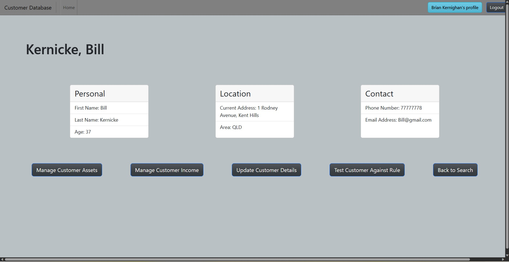

# MERN-customer-assessment-database
A customer database for use in marketing, customer management or social security applications.

## Description

This project exists as a culmination of foundational MERN learning. It has involved the use of GraphQl, ApolloServer, React, ReactRouter, ExpressJS, NodeJS, MongoDB, Mongoose and a significant number of other libraries, packages and dependencies. 
It also exists to solve a realworld problem however. Customer Databases are a part of life in many industries and help people keep track of large numbers of people for applications in marketing, portfolio management, social security, sales and many other industries that rely on being able to identify a customer and their circumstances. The more accurate the assessment the more valuable the data the database can provide. 

## Table of Contents

- [Description](#description)
- [Usage](#usage)
- [Deployment](#deployment)
- [Credits](#credits)
- [License](#license)

## Installation

Once downloaded run npm i to install the required components, then run npm run develop to have the server run on local host.
Otherwise - view it in it's deployed form on Heroku.

## Usage

When the User visits the site they are greated by the homepage and required to login before they can proceed. Their login information is checked in the database to make sure they are allowed to access it. This information then is used to sign a token that will keep the user logged in while they are accessing the database.
The user can then select manage rules or manage customers.
If they select manage rules they are taken to a further choice between whether they wish to add a rule or view rules. 
If they select add a rule they are taken to a form they can submit to add a new rule to the database.
If they select view rules, they can see all of the rules in the database organised into a table. They can choose to delete a rule if they wish to do so.
If the customer selects manage customers that are taken to a choice between add a customer or search customers. 
If they choose add a customer they are taken to the form that adds a customer.
If they choose search customers they are taken to that customer's information. Personal information initially displays.
From here they may select Back, Manage income, Manage assets, test against rule or update customer.
Manage income and manage assets pages contain functionality to add, view and delete income and assets for the customer.  
Test against Rule allows the user to test a customer against the criteria they have previously specified in a rule.
The user can also logout.

## Deployment

Screenshot:

The deployed application:

## Credits

This project makes use of code from the bootcamp activities, as well as starter code - although modified for this purpose.

It also makes use of nodeJS, ExpressJs, React, GraphQl, ApolloServer, and others (check the package for full list of dependencies).

The rest, aside from some help and bugfixes from my teachers, is my own work.

Credit to my teachers, as without them this would not have been possible.

## License

Licensed under the MIT license.

